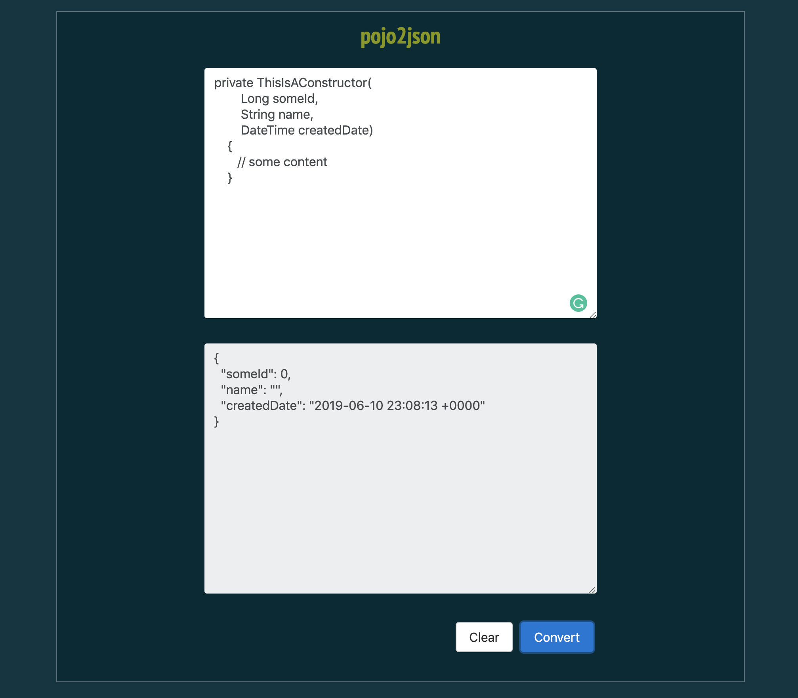

# pojo2json
> Minor scripts to transform Java/Kotlin pojos to JSON

Try the new UI [pojo2json](https://pojo2json.herokuapp.com/index.html)!

## Why?

Because it's booooring to always write field-by-field a JSON.

Input:
```java
    private Event( // constructor
        Long id,
        String body,
        Boolean isUsed,
        DateTime createdTime)
    { ... }
```

Output:
```json
  {
    "id": 0,
    "body": "",
    "isUsed": true,
    "createdTime": "2019-06-07 11:49:24 +0200"
  }
```

## UI

Now with a front-end in test phase!



## Roadmap

- cli?
- front-end
- kotlin pojos
- ~front-end~

## Meta

Alex Rocha - [about.me](http://about.me/alex.rochas) -
